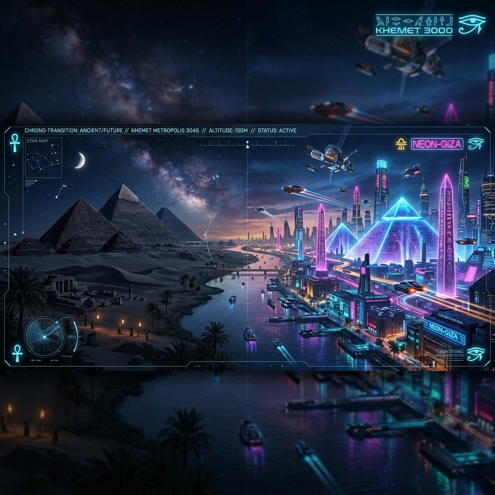
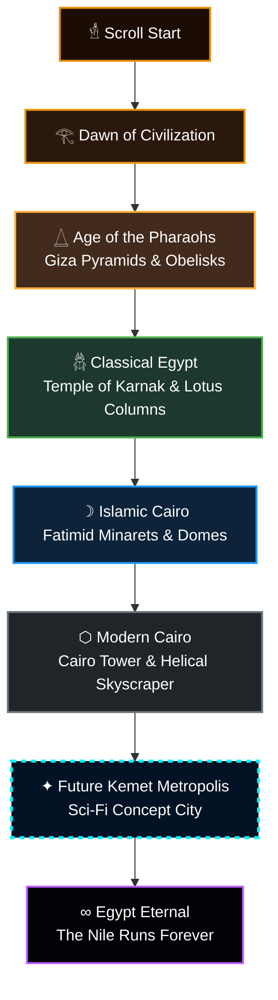

# 𓂀 Egypt Through Time — 3D Scroll-Driven Concept City

<p align="center">
  
</p>

<p align="center">
  
  
  
  
  
  
  
  
</p>

---

## 📖 Project Overview

A premium, interactive 3D scroll-driven visual journey through 6,000 years of Egyptian architecture — from the monumental stone pyramids of the pharaohs to a futuristic, neon-lit sci-fi concept metropolis.

*   **🔗 Live Production URL:** [https://dynamic-murex.vercel.app](https://dynamic-murex.vercel.app)
*   **💻 GitHub Repository:** [Falconbeast21k/city-of-Egypt](https://github.com/Falconbeast21k/city-of-Egypt)

---

## 🗺️ The Scroll Journey

Below is the path the camera travels along as you scroll through the timeline, color-coded by the active atmospheric environment:



---

## 🌌 The Journey Through Eras

| Era | Architectural Style | Core 3D Elements | Visual Palette |
| :--- | :--- | :--- | :--- |
| **Ancient** | Monumental stone | Giza Pyramids, Sphinx, Obelisks, Sand dunes | Sand stone, Amber, Gold |
| **Classical** | Columnar shrines | Karnak Hypostyle Hall, Lotus columns | Marble, Lotus green, Gold |
| **Medieval** | Arabesque stone | Fatimid domes, Minarets, Bazaar stars | Cobalt, Ivory, Gold |
| **Modern** | Steel & glass | Nile bridges, Cairo Tower, Helical Skyscrapers | Steel blue, Concrete grey, Neon red |
| **Future** | Cybernetic concept | Floating pyramids, Honeycomb Citadels, Laser Obelisks | Neon cyan, Violet, Laser green |

---

## 🛸 Sci-Fi Concept Mechanics

To bring the **Future Kemet Metropolis** to life, several interactive 3D systems are proceduralized inside the Three.js scene:

*   🌀 **Holographic Quantum Core**: A giant nested double-octahedron wireframe rotating dynamically above the central helical pyramid, casting flickering sci-fi lighting.
*   🛸 **Segmented Floating Obelisks**: Obelisks split into floating modules hovering out-of-phase with each other, connected by vertical laser beams.
*   🛰️ **Aerial Traffic Lanes**: Glowing curves with light pods (sci-fi flying vehicles) traveling dynamically between modern and future structures.
*   🧬 **Living Honeycomb Citadels**: Clusters of hexagonal prisms that rise and fall dynamically to represent living biotech structures.

---

## 🛠️ Technology Stack & Optimization

*   **Three.js (r128)**: Renders the 3D scene, dynamic lighting, custom glass materials, and line edge frameworks.
*   **GSAP & ScrollTrigger**: Handles smooth camera target interpolations, background scene fog transitions, and HUD progress updates.
*   **Custom Cursor Optimization**: Built using hardware-accelerated CSS `translate3d()` transforms to avoid style parsing lag and layout thrashing.
*   **Offline-first dependencies**: Three.js, GSAP, and ScrollTrigger are bundled locally within the repository to enable local/offline development.

---

## 🚀 Getting Started

### Prerequisites

You only need **Node.js** installed on your system.

### Running Locally

1.  **Clone the repository:**
    ```bash
    git clone https://github.com/Falconbeast21k/city-of-Egypt.git
    cd city-of-Egypt
    ```
2.  **Launch the dev server:**
    ```bash
    npm start
    ```
3.  **Open your browser:**
    Navigate to **`http://localhost:3000/`**.
